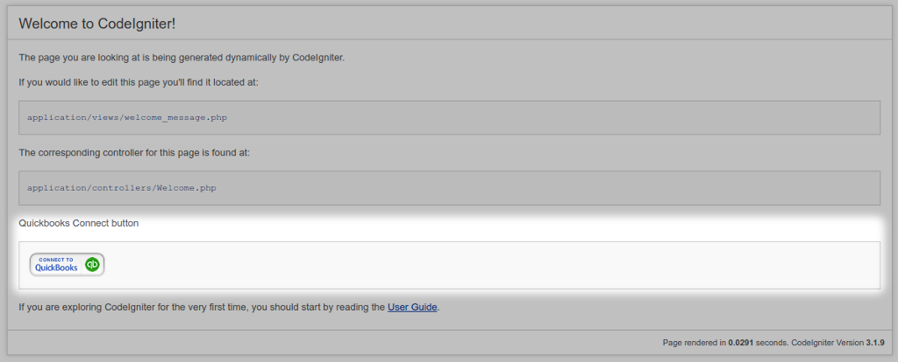
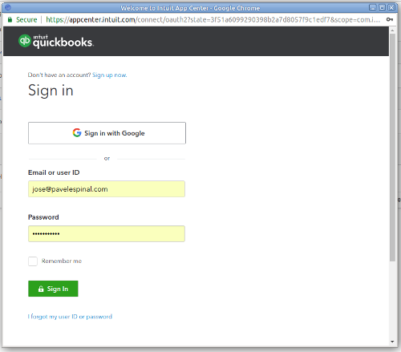
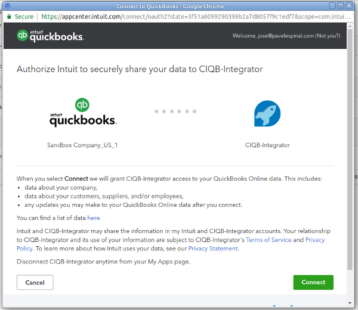
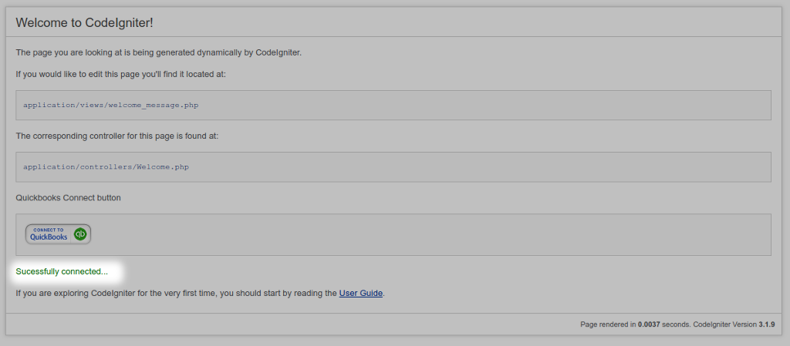

# CodeIgniter - Quickbooks Online SDK integration

The purpose of this project is to show an example integration between [CodeIgniter Framework](https://codeigniter.com/) and the [QuickBooks PHP SDK](https://intuit.github.io/QuickBooks-V3-PHP-SDK/) for connecting QuickBooks Online service. At the same time, this integration might provide some useful insights to CodeIgniter's users about how to take advantage of Composer packages avoiding reinventing the wheel. For achieving this, I'll be using PHP League's [OAuth2 client library](https://github.com/thephpleague/oauth2-client) instead of the Oauth2 library provided by Intuit itself on another repository.

**Update:**

I've added a `Quickbooks.php` library which should greatly streamline your interactions with QuickBooks Online. It is an important addition to this project. You can see it in action in the new `QB_tests.php` controller.

## Getting Started

The scenario/use case is the following: 

1. The user visits a section of the website where a *"Connect"* button is displayed.

2. The user clicks the button, a new window pops up asking him/her to connect to Quickbooks and authorize the application.


3. After logging in and having authorized the application, the page showing the button will now display a new confirmation message indicating that the authorization was successful.



### Prerequisites

For the sake of simplicity, this example assumes that you:

* ...are using a _fresh_ copy of CodeIgniter >=3.1.11. That doesn't mean that you can not use these files with an existing project. Just try to catch up with everything on a fresh installation, then adapt it to your needs.
* ...know how to use Composer and have it configured on your workstation.
* ...have correctly configured your `config.php` file to point to your CodeIgniter's installation directory.
* ...you'll be running composer at the level of your `system` directory (BASEPATH), hence, your `vendor` directory will be there.

After installing, performing further tweaking in order to fit your needs should be an easy task.


### Installing

1. Copy the following lines in the "require" section of your CodeIgniter's `composer.json` file:

```
"quickbooks/v3-php-sdk": "^5.3",
"league/oauth2-client": "^2.4"
```

Or execute (preferable):

```
$ composer require league/oauth2-client
$ composer require quickbooks/v3-php-sdk
```

The final result should look like the following:

```
  "require": {
    "php": ">=5.3.7",
    "quickbooks/v3-php-sdk": "^5.3",
    "league/oauth2-client": "^2.4"
  }
```

Run `composer install` command afterwards (if you decided to manually copy the lines to your `composer.json` instead of using `composer require`).

2. Open the CodeIgniter's config file (`config.php`) and locate the line dedicated to configure **Composer autoload**. Set the value to:

```
'vendor/autoload.php'
```

The final result should look like the following:

```
$config['composer_autoload'] = 'vendor/autoload.php';
```

3. Make sure to autoload the following resources through CodeIgniter's native _config/autoload.php_ file (it will **not** conflict with Composer packages):

Helpers: url, security
Libraries: session
Configs: quickbooks

The final result should look like the following:

```
$autoload['helper'] = ['url','security'];
...
$autoload['libraries'] = ['session'];
...
$autoload['config'] = ['quickbooks'];
```

4. Copy the `application/config/quickbooks.php` file into your **config/** directory and modify the values according to your [Intuit App details](https://developer.intuit.com/getstarted).

5. Copy the file `application/controllers/Qb_oauth_endpoint.php` file into your **controllers/** directory.

6. Copy the file `application/controllers/Qb_tests.php` into your **controllers/** directory.

7. Copy the file `application/views/welcome_message.php` into your **views/** directory (this is just a modified version of the native `welcome_message.php` that comes with CodeIgniter. You'll notice a tiny modification where some Javascript lines were added in order to provide an example of the [authorization workflow](https://developer.intuit.com/docs/0100_quickbooks_online/0100_essentials/000500_authentication_and_authorization/0005_your_app_user_experience)).

8. Copy the file `application/views/qb_tests.php` into your **views/** directory.

9. Copy the file `application/helpers/security_helper.php` into your **helpers/** directory.


## Running the tests

Point your browser to your CodeIgniter's installation (E.g. http://localhost/ciqb-integrator/). You should see a slightly modified version of the `welcome_message.php` template which includes a "Connect to QuickBooks" button.

Click on the button. It should open a popup window asking authenticate yourself to Quickbooks, and authorizing the application (connecting it) afterwards.

Once the application is connected, the popup closes and the page is refreshed showing a "Successfully connected..." message.

You can now point your browser to the **Qb_tests** controller (E.g. http://localhost/ciqb-integrator/index.php/qb_tests) and look some examples in action.


## Authors

* [Pavel Espinal](http://pavelespinal.com)


## License

This project is licensed under the MIT License - see the [LICENSE](LICENSE) file for details


## Acknowledgments

* Intuit, for providing such an elegant PHP SDK.
* The League of Extraordinary Packages, for making the world a better place with their outstanding packages.

## CHANGELOG

* Complete assessment and update of instructions in order to get sure that everything works as described.
